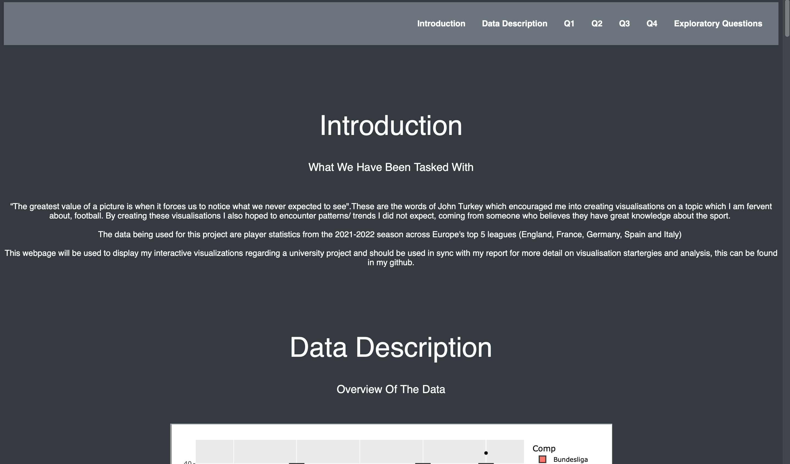
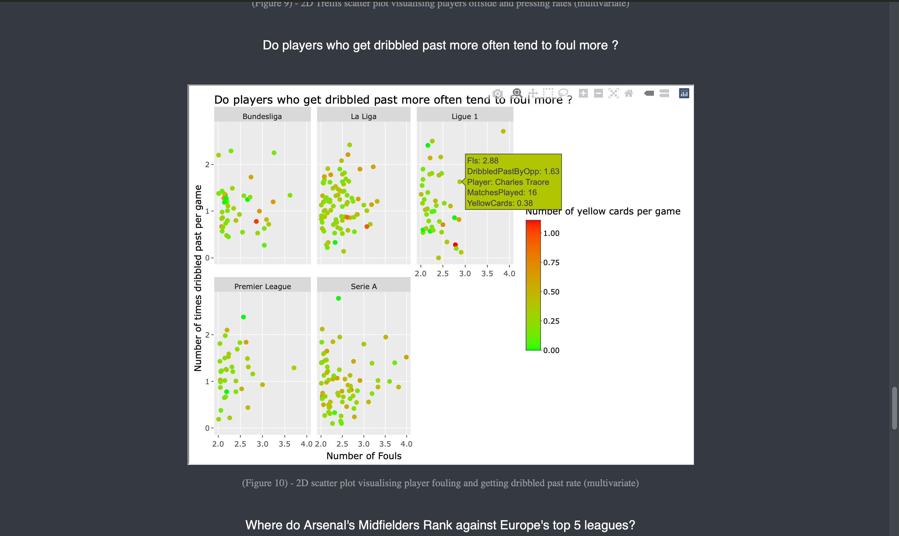
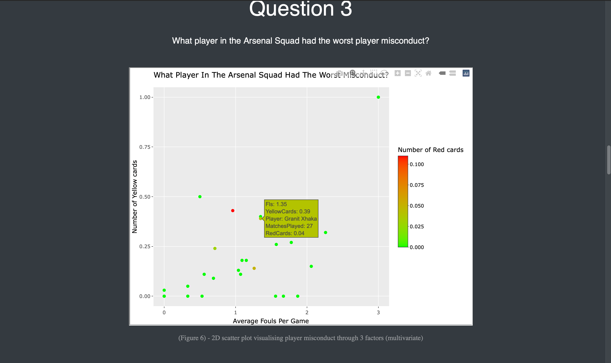

# First R Visualisation

This repositry contains my first data visualisation project using R studio. The aim was to answer research questions in exploratory fashion which would lead me to ask further related questions.

# Repository Contents
* [Report](#report)
* [How To View The Visualisations](#webpage)
* [Code](#code)

## <a name="report"> Report </a>

In the report you can find reasoning behind visualisation stragergies, analysis and evaluation of the visualisations.

Vist the report [here](/Report.pdf).

## <a name="webpage"> How To View The Visualisations </a>

To display my visualisations I created a HTML page in order to utilise the interactivity in the graphs.

You can view the webpage by  :

* Downloading the Zip file containing the webpage files [here](/FIV_HTML.zip)
* Open the index.html file on your browser from within the FIV_HTML directory.

Here is what the page looks like:

## <a name="code"> Code </a>

The code is in a R notebook file, it can be viewed [here](/Rproject/visualisationNotebook.Rmd) 